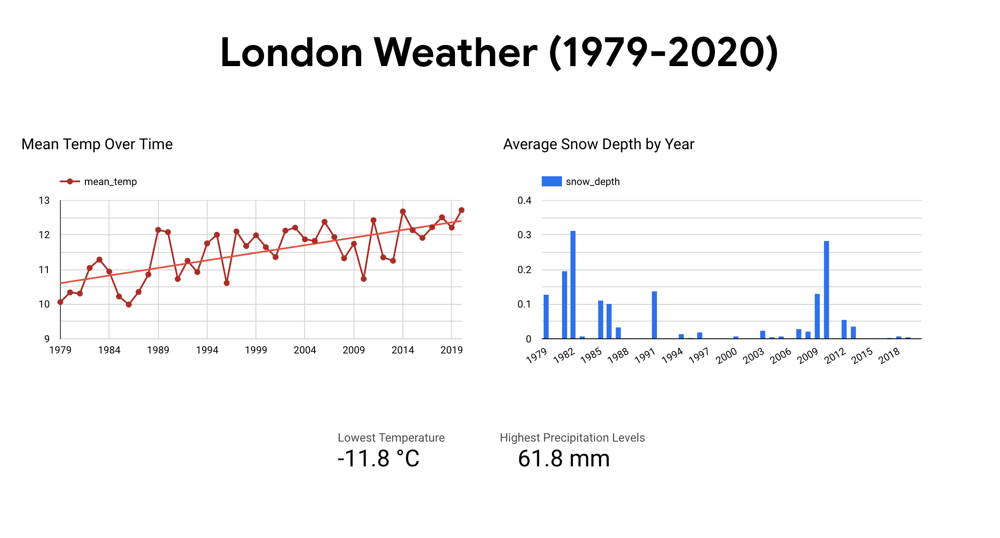

# ETL Pipeline with Weather Data

## Overview
This project involves building an Extract, Transform, Load (ETL) pipeline using publicly available weather data. You'll extract data from a CSV file, transform it using Python, and load it into Google BigQuery for analysis.

## Data Visualization

After uploading the cleaned data to Google BigQuery, Looker Studio was used to visualize the data.

## Data Source
The data was gathered from Kaggle, where each rows of data were provided by the European Climate Assessment. Each measurement were recorded from a weather station near Heathrow Airport in London, UK.

## Data Cleaning
- Some rows had values where the min_temp was higher than max_temp. This seems to be an error during data entry. I decided to remove each rows that met that condition.

## Analysis
- From 1983-1986, the average temperature gradually decreased with 1986 being the coldest year. During this year, there was a polar vortex which caused the cold air from the arctic region to blow towards London.
